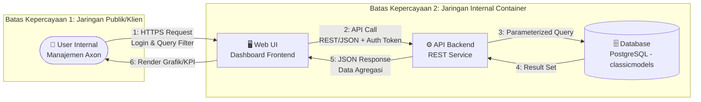

# 🛡️ THREAT MODELING — VERSI 1 (v1)

## SISTEM PENDUKUNG KEPUTUSAN (DSS) PENJUALAN AXON

**Mata Kuliah:** Workshop DevSecOps — Evaluasi Tengah Semester (UTS)
**Peran Penyusun:** Security Engineer
**Metodologi:** STRIDE
**Referensi Acuan:** `PLANNING_PRODUCT_OWNER.md`, `Role.md`, `bab-01.md`, Issue #4 (Milestone 1)
**Versi Dokumen:** 1.0 (Baseline — Pra-Implementasi)
**Status:** Draft untuk direview bersama Developer & Infrastructure Engineer sebelum Milestone 2

> **Catatan Cakupan:** Dokumen ini disusun pada tahap perencanaan (Milestone 1), sebelum implementasi kode dimulai. Analisis difokuskan pada arsitektur dan alur data tingkat tinggi sesuai batasan yang ditetapkan PO. Detail teknis spesifik terkait stack backend/frontend yang dipilih Developer akan didokumentasikan dan dievaluasi ulang pada **Threat Modeling v2** setelah implementasi berjalan.

---

## 1. Ruang Lingkup Analisis

Threat modeling v1 ini mencakup arsitektur **Dashboard DSS Axon** sebagaimana didefinisikan oleh Product Owner:

- Aplikasi web dashboard **read-only/analytical**, ter-kontainerisasi penuh (Docker & Docker Compose).
- Backend berupa **REST API service** yang membaca data dari basis data **PostgreSQL** (skema `classicmodels`).
- Frontend berupa **Web UI interaktif** yang mengonsumsi API tersebut untuk menampilkan 4 modul keputusan bisnis.
- Autentikasi sederhana berbasis peran (_Role-Based Dashboard Access_).
- **Di luar cakupan:** transaksi belanja (cart/checkout/payment), CRUD publik atas data penjualan, dan penggunaan Power BI.

Komponen dianalisis secara **generik berbasis peran arsitektur** (external entity, process, data store, data flow), bukan berdasarkan implementasi kode tertentu.

---

## 2. Identifikasi Aset Kritis

| Kode Aset | Aset                                     | Deskripsi                                                                       | Dampak Bila Terekspos                                             |
| :-------- | :--------------------------------------- | :------------------------------------------------------------------------------ | :---------------------------------------------------------------- |
| A-01      | Kredensial Database PostgreSQL           | Username/password/connection string untuk koneksi backend ↔ database            | Akses penuh ke seluruh data — pelanggaran kerahasiaan total       |
| A-02      | Data Pelanggan Axon                      | Nama, alamat, kontak, sebaran geografis pelanggan (modul Customer Intelligence) | Pelanggaran privasi, risiko reputasi & regulasi                   |
| A-03      | Data Finansial/Transaksi                 | Total revenue, AOV, limit kredit, top spenders                                  | Kebocoran informasi bisnis sensitif, keunggulan kompetitif hilang |
| A-04      | Data Operasional Gudang & Order          | Status stok, status pengiriman/pesanan (Shipped, On Hold, Disputed, dll.)       | Manipulasi dapat menyesatkan keputusan manajemen                  |
| A-05      | Sesi & Kredensial Pengguna Dashboard     | Token sesi/otentikasi peran (role-based access)                                 | Pengambilalihan akun, akses tidak sah ke dasbor internal          |
| A-06      | Hasil Agregasi/Analitik yang Ditampilkan | Grafik, KPI, angka ringkasan pada dashboard                                     | Manipulasi menyesatkan pengambilan keputusan bisnis (integrity)   |
| A-07      | Image Container & Konfigurasi Deployment | Dockerfile, docker-compose.yml, environment variables                           | Titik masuk _supply chain attack_ bila bocor/misconfigured        |

---

## 3. Data Flow Diagram (DFD) — Level 0

**Batas Kepercayaan (Trust Boundary) yang teridentifikasi:**

1. **TB-1 (Klien ↔ Web UI):** Titik paling rentan terhadap serangan dari luar (SQLi via input filter, session hijacking).
2. **TB-2 (Web UI ↔ API Backend):** Perlu validasi token/otorisasi peran di setiap request.
3. **TB-3 (API Backend ↔ Database):** Sesuai kebijakan PO, database **tidak boleh diekspos ke jaringan publik** — hanya backend yang boleh terhubung.

---

## 4. Analisis Ancaman — Metodologi STRIDE

|  #   | Kategori STRIDE            | Komponen Terdampak          | Skenario Ancaman                                                                                                                                           | Aset Terkait     | Tingkat Risiko Awal |
| :--: | :------------------------- | :-------------------------- | :--------------------------------------------------------------------------------------------------------------------------------------------------------- | :--------------- | :-----------------: |
| T-01 | **S**poofing               | Web UI / API Backend        | Penyerang memalsukan identitas pengguna berperan tertentu (mis. mengaku sebagai role manajemen) untuk mengakses dashboard tanpa otorisasi sah              | A-05             |       Tinggi        |
| T-02 | **T**ampering              | Query API → Database        | Manipulasi parameter filter (Tahun/Bulan/Kategori) pada request untuk melakukan **SQL Injection** dan mengubah/membaca data di luar cakupan yang diizinkan | A-01, A-02, A-03 |     **Kritis**      |
| T-03 | **T**ampering              | Data in transit (WEB ↔ API) | Modifikasi data agregasi saat transit apabila komunikasi tidak dienkripsi (tanpa TLS)                                                                      | A-06             |       Tinggi        |
| T-04 | **R**epudiation            | Autentikasi Role-Based      | Tidak adanya audit log memadai membuat pengguna internal dapat menyangkal aktivitas akses/pengubahan pengaturan dashboard                                  | A-05             |       Sedang        |
| T-05 | **I**nformation Disclosure | Database PostgreSQL         | Eksfiltrasi data pelanggan & finansial akibat database yang salah konfigurasi terekspos ke jaringan publik                                                 | A-01, A-02, A-03 |     **Kritis**      |
| T-06 | **I**nformation Disclosure | Kredensial & Secrets        | Kredensial koneksi database ter-hardcode di source code atau bocor lewat commit Git                                                                        | A-01, A-07       |     **Kritis**      |
| T-07 | **I**nformation Disclosure | API Backend                 | Pesan error backend yang terlalu detail (stack trace, query SQL) ditampilkan ke client saat terjadi exception                                              | A-01, A-02       |       Sedang        |
| T-08 | **D**enial of Service      | API Backend / Database      | Query analitik berat (agregasi lintas tahun) dieksploitasi untuk membebani resource server hingga dashboard tidak dapat diakses                            | A-06             |       Sedang        |
| T-09 | **D**enial of Service      | Web UI / API                | Request filter berulang tanpa rate-limiting menyebabkan resource exhaustion                                                                                | A-06             |       Sedang        |
| T-10 | **E**levation of Privilege | Role-Based Access Control   | Kelemahan validasi peran memungkinkan pengguna dengan hak akses terbatas mengakses modul/data yang seharusnya dibatasi (mis. limit kredit pelanggan)       | A-03, A-05       |       Tinggi        |
| T-11 | **E**levation of Privilege | Container Runtime           | Container backend/frontend berjalan sebagai root, memungkinkan _container escape_ untuk mendapatkan akses ke host atau container lain (termasuk database)  | A-07, A-01       |       Tinggi        |
| T-12 | **T**ampering              | Software Supply Chain       | Dependensi pihak ketiga (library frontend/backend) yang mengandung kerentanan atau kode berbahaya disusupkan ke dalam build                                | A-07             |       Tinggi        |

---

## 5. Rekomendasi Mitigasi Awal untuk Developer

| Ref. Ancaman     | Rekomendasi Mitigasi                                                                                                                | Kontrol Terkait Kebijakan PO                      |
| :--------------- | :---------------------------------------------------------------------------------------------------------------------------------- | :------------------------------------------------ |
| T-02, T-05, T-06 | Wajib gunakan **parameterized query / prepared statement** (atau ORM) untuk seluruh kueri; tidak ada konkatenasi string SQL mentah  | Sesuai Tugas 2 Developer & Zero Tolerance SQLi PO |
| T-01, T-10       | Terapkan **otorisasi berbasis peran (RBAC)** di sisi backend (bukan hanya di UI) — validasi peran pada setiap endpoint API          | Selaras dengan modul Role-Based Dashboard Access  |
| T-03             | Gunakan **HTTPS/TLS** untuk seluruh komunikasi Web UI ↔ API Backend                                                                 | Kontrol keamanan dasar                            |
| T-04             | Implementasikan **audit logging** minimal untuk aksi login dan akses modul sensitif (Customer Intelligence)                         | Mendukung bukti audit (_Evidence as Product_)     |
| T-06             | Simpan kredensial database melalui **environment variable/secret manager**, bukan hardcode; pastikan lolos scan Gitleaks/TruffleHog | Zero Tolerance Kredensial Bocor (PO)              |
| T-07             | Nonaktifkan **pesan error verbose** di mode produksi; gunakan pesan generik ke client, detail lengkap hanya di log internal         | Secure coding practice                            |
| T-08, T-09       | Terapkan **rate limiting** dan pembatasan kompleksitas query pada endpoint analitik                                                 | Mitigasi DoS                                      |
| T-05             | Database **tidak boleh diekspos ke jaringan publik**; hanya backend yang dapat menghubunginya (isolasi jaringan container)          | Sesuai Tugas 3 Infrastructure Engineer            |
| T-11             | Jalankan seluruh container dengan **non-root user** dan _read-only filesystem_ jika memungkinkan                                    | Zero Tolerance Privilege Container (PO)           |
| T-12             | Generate **SBOM (CycloneDX/SPDX)** dan jalankan **SCA/Container Image Scan (Trivy)** sebelum build di-deploy                        | Sesuai Tugas 3 Developer & Security Gate PO       |
