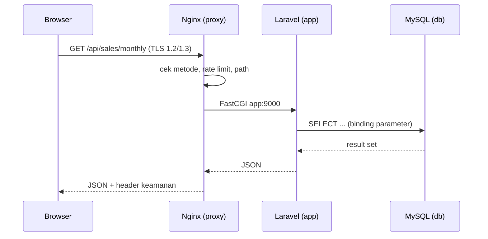

# Infra — Lingkungan Deployment DSS Axon

**Peran:** Infrastructure/Platform Engineer — Ale Perdana Putra Darmawan (3126640016)
**Kelompok 3 DevOps** · Mata kuliah Workshop DevSecOps (UTS)

Folder ini berisi seluruh artefak **Tugas 1–4** role Infra:

| Tugas | Isi | Artefak utama |
| :--- | :--- | :--- |
| Tugas 1 | Lingkungan deployment Docker & Docker Compose | [docker-compose.yml](./docker-compose.yml) |
| Tugas 2 | Hardening container (least privilege) | [docker/app/Dockerfile](./docker/app/Dockerfile), [docker/proxy/Dockerfile](./docker/proxy/Dockerfile) |
| Tugas 3 | Policy admission & isolasi jaringan | [docker/proxy/nginx.conf](./docker/proxy/nginx.conf), [docker/db/20-app-user-privileges.sh](./docker/db/20-app-user-privileges.sh), network `axon-network` |
| Tugas 4 | Otomasi pipeline & gate | [`.github/workflows/ci.yml`](../../.github/workflows/ci.yml), [scripts/run-gates-local.sh](./scripts/run-gates-local.sh) |

Panduan menjalankan: [docs/panduan-build-run.md](./docs/panduan-build-run.md)
Pipeline CI/CD: [§7 di bawah](#7-pipeline-cicd)
Laporan & analisis risiko: [docs/laporan-infra.md](./docs/laporan-infra.md)

---

## 1. Arsitektur Target

Tujuan arsitektur ini sederhana: **hanya ada satu pintu masuk**, dan database sama sekali tidak punya jalan keluar ke host maupun internet.

```text
                     host: 80 / 443  (satu-satunya pintu masuk)
                               │
                       ┌───────▼─────────┐
                       │ proxy (nginx)   │  USER nginx  (non-root)
                       │ - static React  │  terminasi TLS
                       │ - /api → app    │  GET/HEAD saja, header keamanan,
                       └───┬─────────┬───┘  rate limit, access log JSON
     network «axon-public» │ │ network «axon-network» (internal: true)
                               │ │
                     ┌─────────▼─┴────────┐
                     │ app (php-fpm 8.4)  │  USER www-data (non-root)
                     │ Laravel /api       │  tanpa published port
                     └─────────┬──────────┘
                               │ axon-network
                     ┌─────────▼──────────┐
                     │ db (mysql:8.0)     │  TANPA published port (T-05)
                     │ classicmodels      │  tidak punya rute ke luar
                     │ dss_user: SELECT   │  least privilege (arahan PO)
                     └────────────────────┘
```

### Alur satu request (contoh: `GET https://localhost/api/sales/monthly`)

1. Browser membuka `https://localhost/` → diarahkan oleh port 443 host ke port **8443** container `proxy`.
2. Nginx menegosiasikan TLS 1.2/1.3 (sertifikat dev dari `certs/`), lalu menerapkan kebijakan: metode harus `GET`/`HEAD`, rate limit diperiksa, path diperiksa.
3. Karena path dimulai `/api/`, request diteruskan sebagai FastCGI ke `app:9000` — nama service `app` **tidak dapat** di-resolve dari luar jaringan Docker.
4. Laravel memakai kredensial dari environment, terhubung ke host `db:3306` (juga hanya di jaringan `axon-network`), menjalankan query lewat Query Builder (parameter binding).
5. Respons JSON kembali ke Nginx, lalu ke browser. Setiap langkah tercatat pada access log JSON (stdout `proxy`).



> **Catatan pemisahan peran.** Nginx di sini menjalankan peran ganda: sebagai
> *origin* untuk aset statis frontend dan sebagai *reverse proxy* untuk API.
> Ini pola yang dibahas di Bab 4: satu origin untuk UI dan API menghilangkan
> kebutuhan CORS dan mencegah mixed content saat halaman beralih ke HTTPS.

---

## 2. Fungsi & Alasan Setiap Berkas

Setiap berkas ada karena satu kebutuhan konkret — bukan sekadar kelengkapan struktur.

| Berkas | Fungsi | Mengapa ada / mengapa bentuknya begitu |
| :--- | :--- | :--- |
| `docker-compose.yml` | Mendefinisikan 3 service, 2 network, 2 volume | Model deklaratif (Bab 3) membuat topologi bisa direview sebagai kode dan direproduksi; `internal: true` adalah cara paling andal memaksa isolasi database (T-05) — bukan sekadar "tidak menulis `ports`". |
| `docker/app/Dockerfile` | Membangun image backend Laravel | Dependensi dipasang di **stage terpisah** (Bab 2: multi-stage build) sehingga `composer` dan toolchain build tidak ikut ke image akhir. Lebih kecil = attack surface lebih sempit. `USER www-data` memenuhi T-10. **PHP 8.4** dipakai karena `composer.lock` mengunci 19 paket produksi (termasuk `symfony/console v8.1.8`) yang mensyaratkan `php >= 8.4.1`; hanya biner composer yang diambil dari image `composer:2` supaya versi PHP penginstall dan runtime identik. |
| `docker/app/php.ini` | Hardening PHP | `expose_php=Off` menegakkan EXP-8; `display_errors=Off` + `log_errors=On` memisahkan pesan client (generik) dari detail internal (T-07). |
| `docker/app/zz-axon-fpm.conf` | Override pool php-fpm | `clear_env = no` **wajib**: php-fpm secara default membersihkan environment pekerja, sehingga Laravel tidak akan melihat `DB_HOST`/`APP_KEY` dari Compose jika image tidak menyertakan berkas `.env`. |
| `docker/app/entrypoint.sh` | Menunggu database siap, lalu `exec php-fpm` | `exec` membuat php-fpm menjadi PID 1 agar sinyal `stop` dari Docker diteruskan dengan benar (shutdown rapi); penantian mencegah container mati hanya karena initdb belum selesai. |
| `docker/proxy/Dockerfile` | Membangun image Nginx + hasil build React | Build frontend dilakukan di stage Node, lalu hanya folder `dist/` yang disalin — `node_modules` dan npm cache tidak pernah masuk image akhir. |
| `docker/proxy/nginx.conf` | Seluruh kebijakan lapisan web | Menjadi satu tempat review untuk TLS, header, pembatasan metode, rate limit, dan logging; memudahkan Security mencocokkan implementasi dengan baseline mereka. |
| `docker/db/20-app-user-privileges.sh` | Menegakkan least privilege user database | Dijalankan di dalam fase initdb MySQL, **setelah** entrypoint resmi membuat user dengan `GRANT ALL`. Skrip mencabut hak berlebih lalu menyisakan `SELECT`, dan **memverifikasi** hasilnya lewat `SHOW GRANTS` — bila masih ada hak tulis, inisialisasi digagalkan (fail-closed). Ini menegakkan arahan `docs/PO/1.1. Architecture.md` (Data Tier) dan menutup dampak T-02 bila suatu saat ada celah di aplikasi. |
| `scripts/gen-certs.sh` | Membuat sertifikat TLS development | Nginx tidak bisa start tanpa `ssl_certificate`. Skrip membuatnya secara deterministik dengan SAN `localhost` + loopback, sehingga pengujian lokal dan `verify-deployment.sh` bisa berjalan. |
| `scripts/up.sh` | Bootstrap satu perintah | Menyatukan urutan yang mudah salah: isi `.env` → buat `APP_KEY` → buat sertifikat → validasi → build → up. |
| `scripts/smoke-test.sh` | Membuktikan kepatuhan kebijakan | Mengubah "seharusnya aman" menjadi bukti yang bisa dilampirkan: setiap pemeriksaan menyebut kode kontrol (TLS-x/EXP-x/T-xx) yang diuji. Termasuk pemeriksaan CORS ketat dan hak akses database. |
| `scripts/generate-sbom.sh` | Menghasilkan SBOM CycloneDX | Menutup Prioritas P1 pada `docs/PO/2.1 Developer Analysis Result.md`. Memakai Trivy — tool yang sama dengan pemindai SCA — sehingga tidak menambah dependensi baru ke proyek Developer maupun menambah entri rantai pasok yang harus diaudit. |
| `scripts/run-gates-local.sh` | Menjalankan gate secara lokal | Bab 1 dan Bab 3 menekankan gate yang dapat direproduksi: kalau hasil lokal berbeda dari pipeline, orang berhenti mempercayai gate. Skrip menjalankan Gate 1, 3, 4, 5 dengan tool dan versi yang sama seperti di pipeline. |
| [`../../.github/workflows/ci.yml`](../../.github/workflows/ci.yml) | Pipeline Security Gate | **Wajib berada di root**: GitHub Actions hanya membaca workflow dari `.github/workflows/`. Struktur resmi pada README repositori juga menempatkannya di sana. Penjelasan lengkap ada di [§7](#7-pipeline-cicd). |
| [`../../.github/dependabot.yml`](../../.github/dependabot.yml) | Memperbarui pin rantai pasok | Pinning action ke commit SHA menutup risiko tag dipindahkan, tetapi membuat kita tidak otomatis menerima patch pada action itu sendiri. Dependabot adalah pasangan wajib dari strategi pinning; tanpa itu pin berubah menjadi utang teknis. |
| `.env.example` | Template konfigurasi runtime | Satu-satunya tempat nilai environment didokumentasikan; berkas `.env` yang asli tidak pernah masuk Git (T-06). |
| `.gitignore` | Menjaga rahasia keluar dari Git | Mengabaikan `.env`, `certs/*`, `evidence/`, `logs/`. Aturan Zero Tolerance Kredensial Bocor (PO) akan menggagalkan pipeline bila ini bocor. |
| `certs/.gitkeep` | Menjaga folder `certs/` ada | Docker me-mount `./certs`; folder harus ada sebelum sertifikat dibuat, tetapi **isi** folder tetap diabaikan Git. |
| `../.dockerignore` | Membatasi konteks build | Konteks build adalah folder `docs/`, sehingga tanpa berkas ini seluruh dokumen PO/SEC-ENG ikut terkirim ke daemon Docker. Juga mencegah `vendor/`, `node_modules/`, dan `.env` ikut ke layer image. |

---

## 3. Keputusan Teknis (dipilih vs ditolak)

| Aspek | Keputusan | Alternatif yang ditolak | Alasan |
| :--- | :--- | :--- | :--- |
| Versi PHP | **8.4** | Tetap `php:8.3` | `composer.lock` mengunci `symfony/console v8.1.8` (dependensi **produksi**) dan 18 paket lain yang mensyaratkan `php >= 8.4.1`. Tanpa `config.platform`, `composer install` memverifikasi syarat itu terhadap PHP nyata, sehingga build di 8.3 **tidak akan pernah** berhasil. `docs/PO/1.1. Architecture.md` juga menetapkan PHP 8.4. Verifikasi: `composer check-platform-reqs` dijalankan saat build agar kegagalan terdeteksi lebih awal. |
| Nama jaringan | `axon-network` (privat) + `axon-public` | `internal` / `public` | Arahan eksplisit PO pada `docs/PO/2.1 Developer Analysis Result.md` bagian 6 menyebut jaringan privat bernama `axon-network`. Penamaan yang sama di dokumen dan implementasi mencegah salah tafsir saat audit. |
| Hak akses user DB | `dss_user` hanya `SELECT` | `GRANT ALL` bawaan entrypoint MySQL | `docs/PO/1.1. Architecture.md` (Data Tier) mewajibkan hak minimal. Dashboard read-only, jadi hak tulis hanya menambah dampak bila aplikasi pernah punya celah. Konsekuensinya migrasi Laravel tidak bisa dijalankan dengan user ini — disengaja dan didokumentasikan. |
| Proses Nginx | Non-root (`USER nginx`), dengarkan 8080/8443 | `nginx:alpine` bawaan yang berjalan sebagai root di 80/443 | Gate 4 mewajibkan `USER` terakhir non-root (T-10), dan PO menetapkan Zero Tolerance untuk privilege container. Port publik tetap 80/443 lewat pemetaan, jadi tidak ada dampak bagi pengguna. |
| Engine database | **MySQL 8.0** | PostgreSQL 16 | Dump yang disediakan (`database/axon-postgresql.sql`) ternyata dump MySQL (backtick, `int(11)`, `ENGINE=`). Percobaan porting ke PostgreSQL (`app/backend/fixed-postgres.sql`) tidak valid karena masih memakai `int(11)`. Lihat [laporan](./docs/laporan-infra.md) untuk buktinya. |
| Versi MySQL | Di-pin `8.0` | `mysql:latest` (8.4+) | Dump memakai *display width* (`int(11)`) yang sudah usang; versi 8.0 masih menerimanya. Pinning juga membuat build deterministik (Bab 2). |
| Penyajian frontend | Satu Nginx untuk statis + proxy `/api` | Container frontend terpisah / Vite dev server | Satu origin → tanpa CORS, tanpa mixed content, CSP bisa diperketat, dan jumlah container yang perlu diamankan berkurang. |
| URL API frontend | `VITE_API_URL=/api` (relatif) | `http://localhost:8000/api` (default kode) | Default tersebut hanya benar untuk pengembangan lokal Developer; di deployment, browser akan memanggil origin yang salah dan terkena blokir CSP/CORS. Diatur sebagai build-arg, bukan dengan mengubah kode Developer. |
| Data MySQL | Named volume `db-data` | Bind mount ke folder repo | Named volume tidak membawa kepemilikan folder host ke container (menghindari masalah permission), dan tidak membuat data runtime tampak seperti bagian repo. |
| Penyimpanan Laravel | Named volume `app-storage` + `bootstrap/cache` tmpfs | Bind mount / membiarkan rootfs writable | Memungkinkan `read_only: true` pada container (kontrol yang diminta PO) tanpa membuat Laravel gagal menulis cache dan sesi. |
| Log Nginx | stdout container (JSON) | Bind mount ke folder host | Log tidak bisa ditulis ke rootfs read-only; stdout otomatis dikumpulkan Docker, dan batas `max-size`/`max-file` menegakkan retensi (LOG-4). |
| Sertifikat | Self-signed dari skrip, di luar Git | Commit sertifikat, atau langsung Let's Encrypt | TLS-5 mengizinkan self-signed untuk development dan mewajibkan CA tepercaya di produksi. Private key tidak boleh masuk repositori (Bab 4: siklus hidup sertifikat). |
| Batas resource | `deploy.resources.limits` + `client_max_body_size` + `pm.max_children` | Tanpa batas | Mitigasi T-08/T-09: query agregasi berat atau banjir request tidak boleh menghabiskan CPU/RAM host. |
| CSP | `'self'` saja (tanpa CDN) | Menyalin contoh baseline dengan `cdn.jsdelivr.net` + `'unsafe-inline'` | Baseline 2.3 meminta CSP disesuaikan dengan sumber aset sebenarnya; frontend mem-bundle seluruh asetnya secara lokal, jadi tidak ada alasan membuka origin luar. |

---

## 4. Matriks Port (implementasi dari 02-exposure-control 2.1)

| Layanan | Port container | Dipublish ke host? | Bukti |
| :--- | :--- | :--- | :--- |
| Nginx (reverse proxy) | 8080 (HTTP), 8443 (HTTPS) | **Ya:** `80:8080`, `443:8443` | `docker compose config` menampilkan hanya service `proxy` yang punya `ports` |
| Laravel (php-fpm) | 9000 | **Tidak** | `docker compose port app 9000` melaporkan tidak ada published port; hanya `proxy` yang tersambung ke network `axon-network` |
| MySQL | 3306 | **Tidak (wajib)** | `docker compose port db 3306` melaporkan tidak ada published port; network `axon-network` bersifat `internal: true` |

---

## 5. Pemetaan Kontrol ke Kebijakan Security Engineer

Kebijakan ditetapkan Security Engineer; tabel ini menunjukkan **di mana** setiap kontrol diimplementasikan oleh Infra.

| Kontrol | Implementasi Infra | Status |
| :--- | :--- | :--- |
| TLS-1 (protokol) | `ssl_protocols TLSv1.2 TLSv1.3` | ✅ |
| TLS-2 (redirect) | `return 301 https://$host$request_uri` pada server HTTP | ✅ |
| TLS-3 (HSTS) | `add_header Strict-Transport-Security ... always` | ✅ |
| TLS-4 (cipher) | `ssl_ciphers` AEAD/ECDHE saja + `ssl_session_tickets off` | ✅ |
| TLS-5 (sertifikat) | `scripts/gen-certs.sh` (dev self-signed; produksi wajib CA) | ✅ dev |
| TLS-6 (terminasi + backend tidak dipublish) | Terminasi di Nginx; `app` tanpa `ports` | ✅ |
| TLS-7 (Laravel sadar proxy) | Nginx mengirim `REQUEST_SCHEME`/`HTTPS` via `fastcgi_params`; pengaturan `TrustProxies` ada di sisi aplikasi → **handoff ke Developer** | ⚠️ handoff |
| TLS-8 (cookie) | `SESSION_SECURE_COOKIE=true`, `SESSION_SAME_SITE=lax` | ✅ |
| TLS-9 (mixed content) | Seluruh aset lokal; API dipanggil relatif (`/api`) | ✅ |
| EXP-1 (GET/HEAD saja) | `if ($request_method !~ ^(GET\|HEAD)$) { return 405; }` | ✅ |
| EXP-2 (daftar route) | Infra hanya meneruskan prefix `/api/`; daftar route milik Developer | ⚠️ Developer |
| EXP-3 (path sensitif) | Blok `/.`, `/storage/`, `/vendor/`, `/composer.*`, `/telescope`, `/_debugbar`, dll → 404 | ✅ |
| EXP-4 (paket debug tidak di produksi) | Build memakai `composer install --no-dev` | ✅ |
| EXP-5 (rate limit) | `limit_req` 10 r/s, `burst=20`, `limit_req_status 429` | ✅ |
| EXP-6 (validasi parameter) | Ada di sisi aplikasi → **Developer** | ⚠️ Developer |
| EXP-7 (kolom sensitif) | Ada di sisi aplikasi → **Developer** | ⚠️ Developer |
| EXP-8 (versi software) | `server_tokens off`, `expose_php=Off`, `fastcgi_hide_header X-Powered-By` | ✅ |
| LOG-1..LOG-3 (access/error/ditolak) | `log_format axon_json` ke stdout; error php-fpm ke stderr | ✅ |
| LOG-4 (query lambat) | Ada di sisi aplikasi (`DB::listen`) → **Developer** | ⚠️ Developer |
| LOG-5 (start/stop container) | Driver `json-file` Docker + `docker compose ps` | ✅ |

| Ancaman TM v1 | Mitigasi Infra |
| :--- | :--- |
| T-03 data in transit | TLS 1.2/1.3 di proxy, HSTS, redirect permanen |
| T-04 repudiation | Access log JSON dengan `req_id`, `ip`, `status`, `rt` |
| T-05 database terekspos | network `axon-network` bersifat `internal: true` + tanpa `ports` pada `db` |
| Least privilege DB (arahan PO) | `docker/db/20-app-user-privileges.sh` → user aplikasi hanya `SELECT` |
| T-06 kredensial bocor | Semua kredensial dari `${VAR}`; `.env` di-gitignore; `rm -f .env` di Dockerfile |
| T-07 error verbose | `APP_DEBUG=false`, `display_errors=Off`, `expose_php=Off` |
| T-08 DoS query berat | Batas CPU/RAM, `pm.max_children`, `client_max_body_size`, timeout FastCGI |
| T-09 DoS request | `limit_req` 429 |
| T-10 privilege container | Non-root di kedua image, `cap_drop: ALL`, `no-new-privileges`, `read_only` |
| T-11 supply chain | Base image & image tool di-pin, action di-pin ke commit SHA, dependensi dari `composer.lock`/`package-lock.json`, `--no-dev`, Dependabot aktif, pemindaian Trivy di Gate 3 & 5 |

---

## 6. Troubleshooting

Prinsipnya mengikuti Bab 3 & 4: **status container → log → network → volume → konfigurasi**. Jangan menghapus volume sebelum tahu apakah datanya masih dibutuhkan.

| Gejala | Penyebab yang mungkin | Tindakan |
| :--- | :--- | :--- |
| `proxy` gagal start dengan pesan `cannot load certificate` | `certs/` kosong | `bash scripts/gen-certs.sh` |
| `proxy` restart terus menerus | Sertifikat tidak ada, atau port 80/443 host sudah dipakai | Cek `docker compose logs proxy`; ubah `HTTP_PORT`/`HTTPS_PORT` di `.env` |
| `/api/...` mengembalikan 502 Bad Gateway | php-fpm belum siap atau crash | `docker compose logs app`; pastikan healthcheck `app` sudah `healthy` |
| `/api/...` mengembalikan 500 | `APP_KEY` kosong atau kredensial DB salah | Cek log `app`; bandingkan `.env` dengan `MYSQL_*` pada service `db` |
| API mengembalikan `[]` / 0 | Inisialisasi database belum selesai atau impor gagal | `docker compose logs db`; cek tabel: `docker compose exec db mysql -udss_user -p classicmodels -e "SHOW TABLES"` |
| Build `app` gagal: *"your lock file does not contain a compatible set of packages"* | Versi PHP image lebih rendah daripada syarat `composer.lock` (>= 8.4.1) | Pastikan `ARG PHP_VERSION=8.4` pada `docker/app/Dockerfile`; cek `docker compose build app` menampilkan PHP 8.4 |
| `php artisan migrate` gagal: *Access denied / command denied* | User aplikasi hanya punya `SELECT` (memang disengaja, least privilege) | Untuk keperluan DDL saja, pakai kredensial root sekali jalan — prosedurnya ada di [panduan-build-run.md](./docs/panduan-build-run.md) |
| Container `db` berhenti saat pertama kali start, log memuat `[initdb] GAGAL` | Verifikasi least privilege menemukan hak tulis yang masih tersisa | Periksa `docker compose logs db`; pastikan `docker/db/20-app-user-privileges.sh` ter-mount dan `DB_USERNAME` valid (huruf/angka/underscore) |
| Workflow CI tidak muncul di tab Actions | Berkas workflow tidak berada di `.github/workflows/` root | Pindahkan ke root; GitHub mengabaikan workflow di sub-folder |
| Halaman tampil tapi grafik kosong | Browser memblokir permintaan keluar karena CSP | Buka DevTools → Console; pastikan API dipanggil ke origin yang sama (`/api`) |
| 429 Too Many Requests saat membuka halaman | Rate limit terlalu ketat untuk jumlah aset | Naikkan `burst` pada `nginx.conf`, atau kelompokkan aset |
| Perubahan kode tidak berefek | `opcache.validate_timestamps=0` (memang disengaja) | Rebuild image: `docker compose build app && docker compose up -d app` |

Perintah diagnosa cepat:

```bash
docker compose -f docs/INFRA/docker-compose.yml ps
docker compose -f docs/INFRA/docker-compose.yml logs --tail 100
docker compose -f docs/INFRA/docker-compose.yml exec proxy nginx -t
docker compose -f docs/INFRA/docker-compose.yml exec db mysqladmin status -uroot -p
```

---

## 7. Pipeline CI/CD

**Platform:** GitHub Actions (tidak ada sistem CI lain).
**Berkas:** [`.github/workflows/ci.yml`](../../.github/workflows/ci.yml)

### 7.1 Mengapa workflow ada di root, bukan di `docs/INFRA/`

GitHub Actions **hanya** membaca workflow dari `.github/workflows/` pada root repositori.
Berkas di sub-folder seperti `docs/INFRA/.github/workflows/` tidak akan pernah dieksekusi.
Struktur resmi pada `README.md` repositori juga menempatkan `.github/workflows` di root.

Jadi pembagiannya: **pipeline di root (satu-satunya tempat yang berfungsi), seluruh konfigurasi lain di `docs/INFRA/`,** dan `.env`, sertifikat, serta panduan deploy tetap lokal.

### 7.1b Mengapa namanya `ci.yml`

Backlog PO pada `README.md` (bagian "Apa yang BELUM Diimplementasikan", butir 1)
menunjuk path `.github/workflows/ci.yml` secara eksplisit. Nama itu yang dipakai agar
dokumen dan repositori menunjuk berkas yang sama. Nama workflow di dalamnya tetap
`security-gate` karena itulah yang bermakna di tab Actions.

### 7.1c Cara mengisi folder `/reports` (butir 3 backlog PO)

PO meminta laporan hasil pemindaian (SARIF/JSON) tersimpan di `docs/SEC-ENG/reports/`.
Skrip gate lokal dapat diarahkan ke sana:

```bash
REPORTS_DIR=docs/SEC-ENG/reports bash docs/INFRA/scripts/run-gates-local.sh
```

Hasilnya:

| Berkas | Isi | Kegunaan |
| :--- | :--- | :--- |
| `gitleaks.sarif` | Temuan secret | Dapat diunggah ke tab Security GitHub |
| `trivy-fs.sarif` | Temuan CVE/misconfig dependensi | Dapat diunggah ke tab Security GitHub |
| `trivy-fs.json` | Arsip bukti terstruktur | Dilampirkan ke laporan UTS |
| `gates-local-<waktu>.log` | Log lengkap seluruh gate | Bukti proses |

### 7.2 Gate yang dijalankan

Berkas: [`.github/workflows/ci.yml`](../../.github/workflows/ci.yml) — dinamai `ci.yml` sesuai penunjukan PO.

| Gate | Nama | Tool | Blocking? | Ancaman yang ditutup |
| :---: | :--- | :--- | :---: | :--- |
| 1 | Secret scan | Gitleaks (config milik Security) | ✅ | T-06 |
| 2 | SAST | SonarCloud | ⚠️ **non-blocking** sementara | T-02, T-06, T-07 |
| 3 | SCA + SBOM | Trivy fs + CycloneDX | ✅ untuk CRITICAL | T-11 |
| 4 | Infra policy + lint Dockerfile | `check-infra-policy.sh` + Hadolint | ✅ | T-05, T-06, T-07, T-10, T-11, T-02 |
| 5 | Container image scan | `docker compose build` + Trivy image | ✅ | T-10, T-11 |
| 6 | Ringkasan | — | ✅ | pintu tunggal untuk branch protection |

**Mengapa Gate 2 non-blocking.** Quality Gate `Axon-DSS-Baseline` buatan Security Engineer mensyaratkan `new_coverage >= 70%`, sedangkan saat ini hanya ada dua berkas tes skeleton Laravel (~350 byte) dan nol tes API — coverage pasti 0% dan gate akan merah permanen. Keputusannya: job tetap berjalan dan melaporkan, tetapi belum memblokir, sampai Developer menambah tes. **Setelah tes tersedia, hapus `continue-on-error` pada job `sast-sonar`** untuk menjadikannya gate nyata. Kondisi ini dicatat sebagai risiko residual di [laporan](./docs/laporan-infra.md) agar tidak menimbulkan kesan aman yang palsu.

**Mengapa Gate 5 memakai `docker compose build`, bukan build per-Dockerfile.** Konteks build kedua image adalah folder `docs/` (lihat `build.context: ..`), sehingga pola template Security yang menjalankan `docker build -f <dir>/Dockerfile <dir>` tidak berlaku di sini.

**Mengapa image diekspor ke tar sebelum dipindai.** Trivy membaca image dari hasil `docker save` alih-alih diberi akses ke `/var/run/docker.sock`. Ini mengurangi privilege yang diberikan ke container pemindai.

**Laporan HIGH.** Sesuai `docs/PO/1.2 Risk.md`, CRITICAL memblokir sedangkan HIGH dilaporkan terpisah untuk triase — bukan diabaikan, tetapi tidak memblokir sendiri.

### 7.3 Yang perlu kamu siapkan sekali di GitHub

1. **Secret** `SONAR_TOKEN` → *Settings → Secrets and variables → Actions → Secrets*.
2. **Variable** (bukan secret) `SONAR_ORGANIZATION` dan, bila memakai server sendiri, `SONAR_HOST_URL`
   (default kode: `https://sonarcloud.io`).
3. **Branch protection** untuk `dev` dan `main` dengan required status check
   **`Security Gate - PASSED`** — inilah job ringkasan yang menjadi pintu tunggal.
4. Bila Quality Gate ingin dipakai sungguhan, jalankan
   `docs/SEC-ENG/policy/sonarqube/setup-quality-gate.sh` sekali (milik Security Engineer).

> Repositori ini publik, sehingga Actions tanpa batas menit dan SonarCloud dapat dipakai
> pada tier gratis. Bila nanti dijadikan privat, unggah SARIF butuh GitHub Advanced
> Security — karena itu langkah unggah SARIF diberi `continue-on-error` agar gate utama
> tidak ikut gagal.

### 7.4 Menjalankan gate yang sama secara lokal

```bash
bash docs/INFRA/scripts/run-gates-local.sh                  # Gate 1, 3, 4
WITH_IMAGE=1 bash docs/INFRA/scripts/run-gates-local.sh     # + Gate 5 (build & scan image)
```

Skrip memakai **tool dan versi yang sama** dengan pipeline (Trivy 0.58.0, Gitleaks v8.28.0,
Hadolint 2.12.0) supaya hasil lokal dan hasil pipeline tidak berbeda — perbedaan itulah yang
membuat orang berhenti mempercayai gate (Bab 1 & Bab 3).

Hasilnya ditulis ke `docs/INFRA/evidence/` untuk dilampirkan sebagai bukti.

### 7.5 Kesiapan rantai pasok (T-11)

| Kontrol | Implementasi |
| :--- | :--- |
| Action tidak bisa dipindah-tag | Semua action di-pin ke **commit SHA** (bukan tag) |
| Tool pemindai tidak bisa dipindah versi | Gitleaks, Trivy, Hadolint dipanggil sebagai image dengan versi ter-pin |
| Pin tetap terbarui | [`.github/dependabot.yml`](../../.github/dependabot.yml) untuk `github-actions`, `docker`, dan `docker-compose` |
| Dependensi aplikasi deterministik | `composer.lock` dan `package-lock.json` keduanya di-commit |
| Privilege minimal di pipeline | `permissions: contents: read` sebagai default; hanya job yang mengunggah SARIF yang menambah `security-events: write` |

### 7.6 Pemenuhan butir backlog PO pada README repositori

| Butir backlog README.md | Status | Artefak |
| :--- | :---: | :--- |
| 1. Aktivasi pipeline di `.github/workflows/ci.yml` | ✅ | [`.github/workflows/ci.yml`](../../.github/workflows/ci.yml) |
| 2. SBOM `backend-sbom.cdx.json` + `frontend-sbom.cdx.json` | ✅ | [scripts/generate-sbom.sh](./scripts/generate-sbom.sh) → `docs/Dev/axon-devsecops-dss/sbom/` |
| 3. Laporan audit SARIF/JSON di `docs/SEC-ENG/reports/` | ✅ | [scripts/run-gates-local.sh](./scripts/run-gates-local.sh) — lihat [§7.1c](#71c-cara-mengisi-folder-reports-butir-3-backlog-po) |
| 4. Uji coba integrasi kontainer runtime | ⏳ | Belum dijalankan pada sesi ini (kesepakatan tanpa build/run); perintahnya di [panduan-build-run.md](./docs/panduan-build-run.md) |
| 5. Penyempurnaan Modul Bisnis DSS | — | Ranah Developer, bukan Infra |
| 6. Threat Modeling v2 | — | Ranah Security Engineer; input dari [laporan](./docs/laporan-infra.md) §6.1 dan §8.3 |
