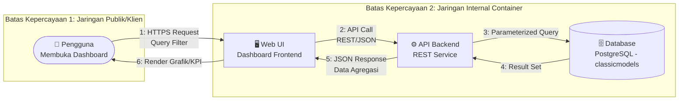

# THREAT MODELING — VERSI 1 (v1)

## SISTEM PENDUKUNG KEPUTUSAN (DSS) PENJUALAN AXON

**Mata Kuliah:** Workshop DevSecOps — Evaluasi Tengah Semester (UTS) 
**Metodologi:** STRIDE 
**Referensi Acuan:** `docs/PO/1. Project-Overview.md`, `docs/PO/1.2 Risk.md`, `Role.md`, `bab-01.md`, Issue #4 (Milestone 1), `Axon_sales_-_Mysql_Database.sql` (skema `classicmodels`)

> **Catatan Cakupan:** Dokumen ini disusun pada tahap perencanaan (Milestone 1), sebelum implementasi kode dimulai. Analisis difokuskan pada arsitektur dan alur data tingkat tinggi sesuai batasan yang ditetapkan PO. Detail teknis spesifik terkait stack backend/frontend yang dipilih Developer akan didokumentasikan dan dievaluasi ulang pada **Threat Modeling v2** setelah implementasi berjalan.

---

## 1. Ruang Lingkup Analisis

Threat modeling v1 ini mencakup arsitektur **Dashboard DSS Axon** sebagaimana didefinisikan oleh Product Owner di `Project-Overview.md`:

- Aplikasi web dashboard **read-only/analytical** — hanya menampilkan agregasi data dan visualisasi grafik, tanpa fungsi transaksi apa pun.
- Ter-kontainerisasi penuh (Docker & Docker Compose).
- Backend berupa **REST API service** yang membaca data dari basis data **PostgreSQL** (skema `classicmodels`, di-porting dari dataset `Axon sales`).
- Frontend berupa **Web UI interaktif** yang menampilkan 4 modul keputusan bisnis (Revenue Overview, Order Fulfillment, Inventory Health, Customer Intelligence).
- **Di luar cakupan (sesuai `Project-Overview.md` 2.1):** transaksi belanja (cart/checkout/payment), CRUD publik atas data penjualan, autentikasi/login, dan penggunaan Power BI.

Karena dashboard bersifat murni tampilan (display-only) tanpa sistem akun, analisis STRIDE di bawah ini difokuskan pada risiko yang relevan untuk arsitektur semacam ini: integritas & kerahasiaan data yang ditampilkan, keamanan koneksi ke database, serta ketahanan infrastruktur — bukan pada manajemen identitas pengguna, yang memang tidak menjadi bagian dari sistem ini.

---

## 2. Identifikasi Aset Kritis

| Kode Aset | Aset | Deskripsi | Tabel/Kolom Terkait (`classicmodels`) | Dampak Bila Terekspos |
| :--- | :--- | :--- | :--- | :--- |
| A-01 | Kredensial Database PostgreSQL | Username/password/connection string untuk koneksi backend ↔ database | — (level infrastruktur) | Akses penuh ke seluruh data — pelanggaran kerahasiaan total |
| A-02 | Data Pelanggan Axon | Nama kontak, alamat, telepon, sebaran geografis pelanggan | `customers` (`customerName`, `contactFirstName`, `contactLastName`, `phone`, `addressLine1/2`, `city`, `state`, `country`) | Pelanggaran privasi, risiko reputasi & regulasi |
| A-03 | Data Finansial/Transaksi | Limit kredit pelanggan, riwayat pembayaran, harga jual/beli produk | `customers.creditLimit`, `payments.amount`, `orderdetails.priceEach`, `products.buyPrice`/`MSRP` | Kebocoran informasi bisnis sensitif; `buyPrice` adalah margin internal |
| A-04 | Data Operasional Gudang & Order | Status pengiriman/pesanan, level stok produk | `orders.status` (Shipped, In Process, On Hold, Cancelled, Resolved, Disputed), `products.quantityInStock` | Manipulasi dapat menyesatkan keputusan manajemen |
| A-05 | Hasil Agregasi/Analitik yang Ditampilkan | Grafik, KPI, angka ringkasan pada dashboard | Hasil query gabungan `orders`+`orderdetails`+`products`+`customers` | Manipulasi menyesatkan pengambilan keputusan bisnis (integrity) |
| A-06 | Image Container & Konfigurasi Deployment | Dockerfile, docker-compose.yml, environment variables | — (level infrastruktur) | Titik masuk _supply chain attack_ bila bocor/misconfigured |
| A-07 | Data Internal Karyawan/Sales Rep | Email, jabatan, struktur pelaporan tenaga penjual | `employees` (`email`, `jobTitle`, `reportsTo`, `officeCode`), terhubung ke `customers.salesRepEmployeeNumber` | Kebocoran struktur organisasi internal & kontak staf |

---

## 3. Data Flow Diagram (DFD) — Level 0

**Batas Kepercayaan (Trust Boundary) yang teridentifikasi:**

1. **TB-1 (Klien ↔ Web UI):** Titik paling rentan terhadap serangan dari luar (SQLi via input filter, scraping data otomatis).
2. **TB-2 (Web UI ↔ API Backend):** Perlu validasi & sanitasi input di setiap request agar tidak diteruskan mentah ke database.
3. **TB-3 (API Backend ↔ Database):** Sesuai kebijakan PO, database **tidak boleh diekspos ke jaringan publik** — hanya backend yang boleh terhubung. Ini adalah batas kepercayaan paling krusial dalam arsitektur ini.

---

## 4. Analisis Ancaman — Metodologi STRIDE

|  #   | Kategori STRIDE            | Komponen Terdampak          | Skenario Ancaman                                                                                                                                           | Aset Terkait     | Tingkat Risiko |
| :--: | :------------------------- | :-------------------------- | :--------------------------------------------------------------------------------------------------------------------------------------------------------- | :--------------- | :-----------------: |
| T-01 | **S**poofing               | Web UI / API Backend        | Karena dashboard tidak memiliki sistem akun (sesuai cakupan PO), tidak ada identitas pengguna yang bisa diverifikasi atau dipalsukan — kategori ini secara arsitektural tidak relevan untuk sistem read-only tanpa login | — | N/A |
| T-02 | **T**ampering              | Query API → Database        | Manipulasi parameter filter (Tahun/Bulan/Kategori) pada request untuk melakukan **SQL Injection**, mengubah/membaca data di luar cakupan yang diizinkan | A-01, A-02, A-03 |     **Kritis**      |
| T-03 | **T**ampering              | Data in transit (WEB ↔ API) | Modifikasi data agregasi saat transit apabila komunikasi tidak dienkripsi (tanpa TLS)                                                                      | A-05             |       Tinggi        |
| T-04 | **R**epudiation            | API Backend                 | Tidak adanya log akses membuat tim kesulitan menelusuri sumber trafik mencurigakan atau pola akses abnormal ke data sensitif                                | A-02, A-03       |       Sedang        |
| T-05 | **I**nformation Disclosure | Database PostgreSQL         | Eksfiltrasi seluruh 8 tabel (termasuk `customers.creditLimit`, `payments`, `employees.email`) akibat database yang salah konfigurasi terekspos ke jaringan publik | A-01, A-02, A-03, A-07 |     **Kritis**      |
| T-06 | **I**nformation Disclosure | Kredensial & Secrets        | Kredensial koneksi database ter-hardcode di source code atau bocor lewat commit Git                                                                        | A-01, A-06       |     **Kritis**      |
| T-07 | **I**nformation Disclosure | API Backend                 | Pesan error backend yang terlalu detail (stack trace, query SQL) ditampilkan ke client saat terjadi exception                                              | A-01, A-02       |       Sedang        |
| T-08 | **D**enial of Service      | API Backend / Database      | Query analitik berat (agregasi `orders` + `orderdetails` + `products` lintas tahun) dieksploitasi untuk membebani resource server hingga dashboard tidak dapat diakses | A-05             |       Sedang        |
| T-09 | **D**enial of Service      | Web UI / API                | Request filter berulang tanpa rate-limiting menyebabkan resource exhaustion                                                                                | A-05             |       Sedang        |
| T-10 | **E**levation of Privilege | Container Runtime           | Container backend/frontend berjalan sebagai root, memungkinkan _container escape_ untuk mendapatkan akses ke host atau container lain (termasuk database)  | A-06, A-01       |       Tinggi        |
| T-11 | **T**ampering              | Software Supply Chain       | Dependensi pihak ketiga (library frontend/backend) yang mengandung kerentanan atau kode berbahaya disusupkan ke dalam build                                | A-06             |       Tinggi        |

---

## 5. Rekomendasi Mitigasi Awal untuk Developer

| Ref. Ancaman     | Rekomendasi Mitigasi                                                                                                                | Kontrol Terkait Kebijakan PO                      |
| :--------------- | :---------------------------------------------------------------------------------------------------------------------------------- | :------------------------------------------------ |
| T-02, T-05, T-06 | Wajib gunakan **parameterized query / prepared statement** (atau ORM) untuk seluruh kueri; tidak ada konkatenasi string SQL mentah  | Sesuai Tugas 2 Developer & Zero Tolerance SQLi PO |
| T-03             | Gunakan **HTTPS/TLS** untuk seluruh komunikasi Web UI ↔ API Backend                                                                 | Kontrol keamanan dasar                            |
| T-04             | Implementasikan **logging dasar** (IP address, timestamp, endpoint yang diakses) di API Backend untuk keperluan monitoring          | Mendukung bukti audit (_Evidence as Product_)     |
| T-05             | Database **tidak boleh diekspos ke jaringan publik**; hanya backend yang dapat menghubunginya (isolasi jaringan container)          | Sesuai Tugas 3 Infrastructure Engineer            |
| T-06             | Simpan kredensial database melalui **environment variable/secret manager**, bukan hardcode; pastikan lolos scan Gitleaks/TruffleHog | Zero Tolerance Kredensial Bocor (PO)              |
| T-07             | Nonaktifkan **pesan error verbose** di mode produksi; gunakan pesan generik ke client, detail lengkap hanya di log internal         | Secure coding practice                            |
| T-08, T-09       | Terapkan **rate limiting** dan pembatasan kompleksitas query pada endpoint analitik                                                 | Mitigasi DoS                                      |
| T-10             | Jalankan seluruh container dengan **non-root user** dan _read-only filesystem_ jika memungkinkan                                    | Zero Tolerance Privilege Container (PO)           |
| T-11             | Generate **SBOM (CycloneDX/SPDX)** dan jalankan **SCA/Container Image Scan (Trivy)** sebelum build di-deploy                        | Sesuai Tugas 3 Developer & Security Gate PO       |
