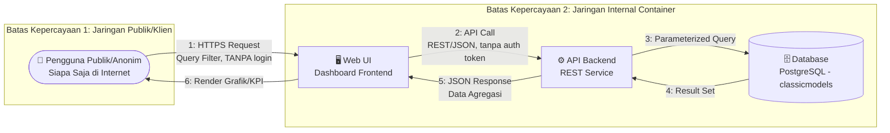

# THREAT MODELING — VERSI 1 (v1)

## SISTEM PENDUKUNG KEPUTUSAN (DSS) PENJUALAN AXON

**Mata Kuliah:** Workshop DevSecOps — Evaluasi Tengah Semester (UTS)
**Metodologi:** STRIDE
**Referensi Acuan:** `docs/PO/1. Project-Overview.md`, `docs/PO/1.2 Risk.md`, `Role.md`, `bab-01.md`, Issue #4 (Milestone 1), `Axon_sales_-_Mysql_Database.sql` (skema `classicmodels`)
**Versi Dokumen:** 1

> **Catatan Cakupan:** Dokumen ini disusun pada tahap perencanaan (Milestone 1), sebelum implementasi kode dimulai. Analisis difokuskan pada arsitektur dan alur data tingkat tinggi sesuai batasan yang ditetapkan PO. Detail teknis spesifik terkait stack backend/frontend yang dipilih Developer akan didokumentasikan dan dievaluasi ulang pada **Threat Modeling v2** setelah implementasi berjalan.

---

## 1. Ruang Lingkup Analisis

Threat modeling v1 ini mencakup arsitektur **Dashboard DSS Axon** sebagaimana didefinisikan oleh Product Owner:

- Aplikasi web dashboard **read-only/analytical**, ter-kontainerisasi penuh (Docker & Docker Compose).
- Backend berupa **REST API service** yang membaca data dari basis data **PostgreSQL** (skema `classicmodels`, di-porting dari dataset MySQL sample `Axon sales`).
- Frontend berupa **Web UI interaktif** yang mengonsumsi API tersebut untuk menampilkan 4 modul keputusan bisnis.
- **Tanpa autentikasi/login** — sesuai `Project-Overview.md` Bagian 2.1 (Out-of-Scope): *"Tidak ada Autentikasi."* Dashboard bersifat akses terbuka (_publicly accessible_) secara sengaja, tidak ada mekanisme login maupun pembedaan peran pengguna.
- **Di luar cakupan:** transaksi belanja (cart/checkout/payment), CRUD publik atas data penjualan, penggunaan Power BI, dan autentikasi.

Komponen dianalisis secara **generik berbasis peran arsitektur** (external entity, process, data store, data flow)
---

## 2. Identifikasi Aset Kritis

| Kode Aset | Aset | Deskripsi | Tabel/Kolom Terkait (`classicmodels`) | Dampak Bila Terekspos |
| :--- | :--- | :--- | :--- | :--- |
| A-01 | Kredensial Database PostgreSQL | Username/password/connection string untuk koneksi backend ↔ database | — (level infrastruktur) | Akses penuh ke seluruh data — pelanggaran kerahasiaan total |
| A-02 | Data Pelanggan Axon | Nama kontak, alamat, telepon, sebaran geografis pelanggan | `customers` (`customerName`, `contactFirstName`, `contactLastName`, `phone`, `addressLine1/2`, `city`, `state`, `country`) | Pelanggaran privasi, risiko reputasi & regulasi |
| A-03 | Data Finansial/Transaksi | Limit kredit pelanggan, riwayat pembayaran, harga jual/beli produk | `customers.creditLimit`, `payments.amount`, `orderdetails.priceEach`, `products.buyPrice`/`MSRP` | Kebocoran informasi bisnis sensitif; `buyPrice` khususnya adalah margin internal — kompetitor bisa hitung keuntungan Axon |
| A-04 | Data Operasional Gudang & Order | Status pengiriman/pesanan, level stok produk | `orders.status` (Shipped, In Process, On Hold, Cancelled, Resolved, Disputed), `products.quantityInStock` | Manipulasi dapat menyesatkan keputusan manajemen |
| A-05 | *(Tidak Ada — Out-of-Scope PO)* Kontrol Akses / Sesi Pengguna | **Tidak ada** token sesi, akun, atau pembedaan peran — dashboard sepenuhnya terbuka ke publik sesuai keputusan cakupan PO. Baris ini dipertahankan sebagai referensi untuk analisis ancaman terkait ketiadaan kontrol akses | *(Tidak ada di skema `classicmodels`, dan memang tidak diimplementasikan sesuai `Project-Overview.md` — lihat catatan Accepted Risk Bagian 1)* | **Seluruh data pada A-02, A-03, A-04, A-08 langsung dapat diakses siapa saja tanpa hambatan apa pun** |
| A-06 | Hasil Agregasi/Analitik yang Ditampilkan | Grafik, KPI, angka ringkasan pada dashboard | Hasil query gabungan `orders`+`orderdetails`+`products`+`customers` | Manipulasi menyesatkan pengambilan keputusan bisnis (integrity) |
| A-07 | Image Container & Konfigurasi Deployment | Dockerfile, docker-compose.yml, environment variables | — (level infrastruktur) | Titik masuk _supply chain attack_ bila bocor/misconfigured |
| A-08 | Data Internal Karyawan/Sales Rep | Email, jabatan, struktur pelaporan tenaga penjual | `employees` (`email`, `jobTitle`, `reportsTo`, `officeCode`), terhubung ke `customers.salesRepEmployeeNumber` | Kebocoran struktur organisasi internal & kontak staf; risiko phishing/social engineering bertarget |

---

## 3. Data Flow Diagram (DFD) — Level 0

**Batas Kepercayaan (Trust Boundary) yang teridentifikasi:**

1. **TB-1 (Klien ↔ Web UI):** **Secara praktis tidak ada batas kepercayaan yang efektif di sini** — tanpa login, siapa pun di internet publik berada pada level kepercayaan yang sama dengan pengguna internal yang dituju. Titik ini rentan terhadap SQLi via input filter, dan juga akses tidak sah oleh siapa saja, bukan cuma penyerang canggih.
2. **TB-2 (Web UI ↔ API Backend):** Tidak ada validasi token/otorisasi peran, karena memang tidak ada mekanisme login. Seluruh permintaan dari Web UI diperlakukan sama tanpa pembedaan hak akses.
3. **TB-3 (API Backend ↔ Database):** Sesuai kebijakan PO, database **tidak boleh diekspos ke jaringan publik** — hanya backend yang boleh terhubung. **Ini menjadi satu-satunya batas kepercayaan yang benar-benar berfungsi di seluruh arsitektur**, karena TB-1 dan TB-2 secara efektif tidak ada.

---

## 4. Analisis Ancaman — Metodologi STRIDE

|  #   | Kategori STRIDE            | Komponen Terdampak          | Skenario Ancaman                                                                                                                                           | Aset Terkait     | Tingkat Risiko Awal |
| :--: | :------------------------- | :-------------------------- | :--------------------------------------------------------------------------------------------------------------------------------------------------------- | :--------------- | :-----------------: |
| T-01 | **S**poofing               | Web UI / API Backend        | **(Prioritas Tertinggi)** Karena dashboard tidak memiliki mekanisme login/autentikasi sama sekali dan terbuka ke internet publik, sistem tidak dapat membedakan pengguna internal Axon yang sah dari pihak mana pun di luar. Ini bukan lagi soal "memalsukan identitas" — tidak ada identitas yang diverifikasi sama sekali, sehingga siapa pun otomatis diperlakukan sebagai pengguna sah dan bisa langsung membaca seluruh data sensitif (A-02, A-03, A-04, A-08) | A-05             |     **Kritis**      |
| T-02 | **T**ampering              | Query API → Database        | Manipulasi parameter filter (Tahun/Bulan/Kategori) pada request untuk melakukan **SQL Injection** dan mengubah/membaca data di luar cakupan yang diizinkan (mis. `customers.creditLimit`, `payments.amount`) | A-01, A-02, A-03 |     **Kritis**      |
| T-03 | **T**ampering              | Data in transit (WEB ↔ API) | Modifikasi data agregasi saat transit apabila komunikasi tidak dienkripsi (tanpa TLS)                                                                      | A-06             |       Tinggi        |
| T-04 | **R**epudiation            | Seluruh Akses Dashboard      | Karena tidak ada akun/sesi pengguna sama sekali, **mustahil mengaitkan aktivitas akses ke individu tertentu** — tidak ada yang bisa "menyangkal" karena memang tidak pernah ada identitas yang tercatat sejak awal. Tim tidak akan punya cara mengetahui siapa saja yang telah mengakses data sensitif                          | A-05             |       Tinggi        |
| T-05 | **I**nformation Disclosure | Database PostgreSQL         | Eksfiltrasi seluruh 8 tabel (termasuk `customers.creditLimit`, `payments`, `employees.email`) akibat database yang salah konfigurasi terekspos ke jaringan publik                                                 | A-01, A-02, A-03, A-08 |     **Kritis**      |
| T-06 | **I**nformation Disclosure | Kredensial & Secrets        | Kredensial koneksi database ter-hardcode di source code atau bocor lewat commit Git                                                                        | A-01, A-07       |     **Kritis**      |
| T-07 | **I**nformation Disclosure | API Backend                 | Pesan error backend yang terlalu detail (stack trace, query SQL) ditampilkan ke client saat terjadi exception                                              | A-01, A-02       |       Sedang        |
| T-08 | **D**enial of Service      | API Backend / Database      | Query analitik berat (agregasi `orders` + `orderdetails` + `products` lintas tahun) dieksploitasi untuk membebani resource server hingga dashboard tidak dapat diakses                            | A-06             |       Sedang        |
| T-09 | **D**enial of Service      | Web UI / API                | Request filter berulang tanpa rate-limiting menyebabkan resource exhaustion                                                                                | A-06             |       Sedang        |
| T-10 | **E**levation of Privilege | *(Tidak Berlaku Saat Ini)* | Karena tidak ada pembedaan level akses sama sekali — tidak ada pengguna "terbatas" maupun "penuh", semua pengguna (termasuk anonim publik) sudah berada di level akses maksimal secara default — tidak ada privilege yang bisa "dieskalasi" lagi. Risiko sebenarnya dari kondisi ini sudah tercakup sepenuhnya di **T-01**. Baris ini dipertahankan sebagai referensi apabila autentikasi/RBAC nantinya diimplementasikan (lihat rekomendasi Bagian 5) | A-03, A-05, A-08 |    N/A (lihat T-01) |
| T-11 | **E**levation of Privilege | Container Runtime           | Container backend/frontend berjalan sebagai root, memungkinkan _container escape_ untuk mendapatkan akses ke host atau container lain (termasuk database)  | A-07, A-01       |       Tinggi        |
| T-12 | **T**ampering              | Software Supply Chain       | Dependensi pihak ketiga (library frontend/backend) yang mengandung kerentanan atau kode berbahaya disusupkan ke dalam build                                | A-07             |       Tinggi        |

---

## 5. Rekomendasi Mitigasi Awal untuk Developer

| Ref. Ancaman     | Rekomendasi Mitigasi                                                                                                                | Kontrol Terkait Kebijakan PO                      |
| :--------------- | :---------------------------------------------------------------------------------------------------------------------------------- | :------------------------------------------------ |
| T-02, T-05, T-06 | Wajib gunakan **parameterized query / prepared statement** (atau ORM) untuk seluruh kueri; tidak ada konkatenasi string SQL mentah  | Sesuai Tugas 2 Developer & Zero Tolerance SQLi PO |
| T-01 (Accepted Risk — Kontrol Kompensasi) | Karena autentikasi resmi **di luar cakupan** (`Project-Overview.md` Bagian 2.1), mitigasi diarahkan ke kontrol kompensasi non-autentikasi: **(a)** rate limiting & WAF di level reverse proxy/infrastruktur untuk membatasi scraping massal, **(b)** `robots.txt`/`noindex` agar tidak terindeks mesin pencari, **(c)** monitoring & alerting atas lonjakan traffic tidak wajar, **(d)** pertimbangkan membatasi/mengagregasi kolom paling sensitif (mis. `creditLimit` per pelanggan individual) alih-alih menampilkan mentah. Keputusan risiko ini dicatat di `WAIVER_LOG.md` | Risk Acceptance resmi PO (`Project-Overview.md` 2.1) — didokumentasikan untuk bukti audit DoD |
| T-10 (kondisional) | Baris ini hanya relevan **jika** autentikasi ditambahkan di masa depan (di luar cakupan UTS saat ini). Bila terjadi, terapkan **otorisasi berbasis peran (RBAC)** di API Backend untuk setiap endpoint, dan pertimbangkan **PostgreSQL Row-Level Security (RLS)** sebagai lapisan kedua | Tidak berlaku untuk cakupan UTS saat ini |
| T-03             | Gunakan **HTTPS/TLS** untuk seluruh komunikasi Web UI ↔ API Backend                                                                 | Kontrol keamanan dasar                            |
| T-04             | Implementasikan **audit logging berbasis IP address & timestamp** (bukan user, karena tidak ada akun) untuk setiap akses ke modul sensitif (Customer Intelligence) — ini satu-satunya bentuk jejak yang memungkinkan sebelum autentikasi diterapkan | Mendukung bukti audit (_Evidence as Product_)     |
| T-06             | Simpan kredensial database melalui **environment variable/secret manager**, bukan hardcode; pastikan lolos scan Gitleaks/TruffleHog | Zero Tolerance Kredensial Bocor (PO)              |
| T-07             | Nonaktifkan **pesan error verbose** di mode produksi; gunakan pesan generik ke client, detail lengkap hanya di log internal         | Secure coding practice                            |
| T-08, T-09       | Terapkan **rate limiting** dan pembatasan kompleksitas query pada endpoint analitik                                                 | Mitigasi DoS                                      |
| T-05             | Database **tidak boleh diekspos ke jaringan publik**; hanya backend yang dapat menghubunginya (isolasi jaringan container)          | Sesuai Tugas 3 Infrastructure Engineer            |
| T-11             | Jalankan seluruh container dengan **non-root user** dan _read-only filesystem_ jika memungkinkan                                    | Zero Tolerance Privilege Container (PO)           |
| T-12             | Generate **SBOM (CycloneDX/SPDX)** dan jalankan **SCA/Container Image Scan (Trivy)** sebelum build di-deploy                        | Sesuai Tugas 3 Developer & Security Gate PO       |
